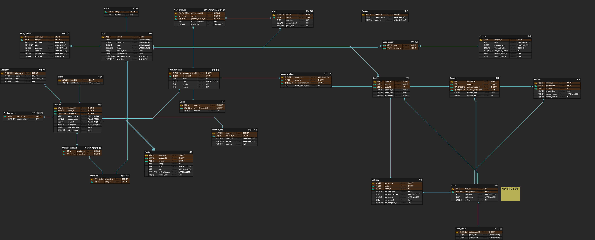

## 🎧 About Project

프로젝트 명 : **아이허브유 🌿**

소개 : 아이허브유(iHerbYou)는 건강과 웰빙을 중시하는 현대인들이 **필요한 영양제를 빠르고 합리적으로 구매**할 수 있도록 기획된 온라인 플랫폼입니다.  
아이허브의 강점을 참고하되, 국내 사용자에게 더 알맞은 맞춤형 서비스와 편리한 결제·배송 경험을 제공하는 것을 목표로 합니다.

## 🚀 Tech Stack

- **Language**: Java 21
- **Framework**: Spring Boot 3.5.5
    - Spring Web
    - Spring Data JPA (Hibernate)
    - Spring Boot DevTools
- **Template Engine**: Thymeleaf
- **Database**: MySQL
- **Build Tool**: Gradle
- **Utilities**: Lombok
- **Testing**: JUnit 5, Spring Boot Starter Test

## 📊 ERD

## 👨🏻‍💻 Team Members

<!-- TEAM-MEMBERS-LIST:START - Do not remove or modify this section -->
<table>
  <tbody>
    <tr>
      <td align="center" valign="top">
        <a href="https://github.com/soojjung">
          
           
          <b>정수진</b>
        </a>
         
        Frontend / Backend
      </td>
      <td align="center" valign="top">
        <a href="https://github.com/shawnchoi8">
          
           
          <b>최승현</b>
        </a>
         
        Backend
      </td>
      <td align="center" valign="top">
        <a href="https://github.com/jaeaeee">
          
           
          <b>최재희</b>
        </a>
         
        Backend
      </td>
      <td align="center" valign="top">
        <a href="https://github.com/ye0nuu">
          
           
          <b>장연우</b>
        </a>
         
        Backend
      </td>
      <td align="center" valign="top">
        <a href="https://github.com/juncity-kim">
          
           
          <b>김준휘</b>
        </a>
         
        Backend
      </td>
    </tr>
  </tbody>
</table>
<!-- TEAM-MEMBERS-LIST:END -->
